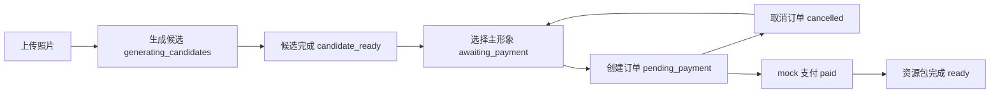

# MyPet Studio 工程拆解与执行规划

## 1. 建设目标

基于前期 PetDex 网站调研、产品需求文档和业务分析报告，建设一个自有品牌的养宠/桌宠网站 MVP。产品目标不是复制 PetDex 的品牌与资产，而是复刻用户价值链路：看到产品卖点、上传宠物、确认形象、选择套餐、完成支付、获得可安装/可导入的桌宠资源。

## 2. 阶段拆分

### P0：网站交易闭环

- 首页：解释产品、引导上传、展示生成流程。
- 生成工作台：照片上传、宠物信息填写、候选图生成、候选选择。
- 套餐与支付：套餐展示、订单创建、mock 支付、订单取消。
- 作品库：历史生成任务、宠物码、资源包下载。
- 后端 API：任务、候选、订单、审计日志四类数据模型。

当前状态：已完成。

### P1：真实交付能力

- 真实 AI 生成队列：接入图像生成/抠图/动作帧生成服务。
- 生成进度：排队、生成中、失败、可重试、已完成。
- 资源包标准：`.petpack` 中包含 manifest、动作表、素材引用、版本号。
- 支付沙箱：支付宝/微信沙箱、回调验签、幂等处理、订单状态机。

当前状态：待开发。

### P2：桌面客户端

- Windows 客户端：导入 `.petpack`、显示桌宠、基础动作播放。
- 宠物码恢复：输入宠物码恢复资源。
- 本地偏好：开机启动、透明窗口、位置锁定、音效开关。

当前状态：待开发。

### P3：商业化与运营

- 用户账号：注册登录、订单归属、作品云同步。
- 后台配置：套餐、价格、权益、公告、FAQ、风控开关。
- 运营增长：邀请码、限时优惠、二次刷新、升级套餐。
- 合规安全：隐私政策、用户删除、图片内容安全、支付风控。

当前状态：待开发。

## 3. 当前实现清单

- `src/main.jsx`：单页应用入口，包含首页、工作台、作品库、下载、套餐、FAQ。
- `src/styles.css`：响应式视觉样式与组件状态。
- `server/index.js`：Express 服务入口，暴露健康检查、静态生成资源和宠物业务路由。
- `server/db.js`：SQLite 表结构、迁移与数据行转换。
- `server/routes/pets.js`：上传、候选生成、选择、订单、mock 支付、下载接口。
- `README.md`：运行说明、接口清单和后续路线。

## 4. 核心数据模型

- `pet_jobs`：生成任务，记录用户、宠物信息、状态、已选候选、套餐、宠物码和资源包路径。
- `candidates`：主形象候选，记录候选图、标签、相似度和选中状态。
- `orders`：套餐订单，记录 SKU、金额、支付状态和支付提供方。
- `audit_logs`：审计日志，记录关键业务动作与上下文。

## 5. 状态机

## 6. 当前风险

- 生成能力仍为 SVG mock，需要接入真实 AI 后才具备生产交付价值。
- 支付仍为 mock，需要支付沙箱和服务端回调后才能上线收费。
- 用户体系未接入，当前 `demo-user` 仅适合本地 MVP。
- 桌面客户端还未实现，下载页当前是占位状态。
- 作品资源存储在本地文件夹，未来上线需要对象存储或受控下载服务。

## 7. 推荐下一步

1. 固化 `.petpack` 协议，先让桌面客户端能导入本地生成资源。
2. 用真实 AI 服务替换 `generateCandidates`，保留现有接口契约。
3. 加入生成任务轮询和失败重试，不阻塞前端请求。
4. 接入支付沙箱，把 mock 支付替换为真实订单回调。
5. 建立最小后台，用于管理套餐价格、订单和生成失败补偿。
