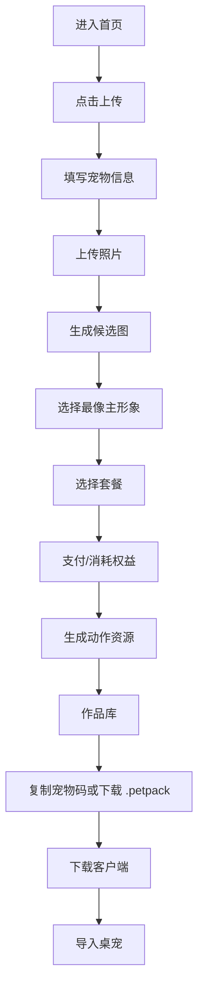
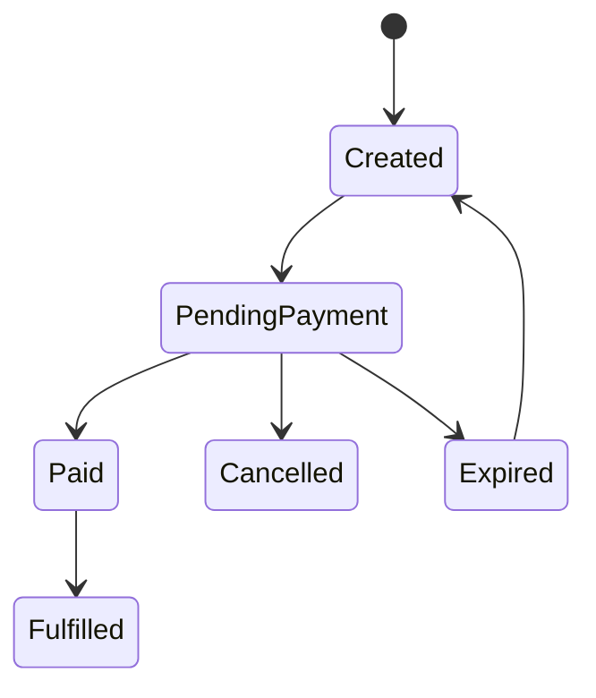

# 修正版产品需求 PRD：AI 宠物桌面伙伴

## 1. 产品定义

产品名称暂定：MyPet Desktop Companion  
产品类型：AI 宠物生成网站 + 桌面客户端  
目标：让用户上传宠物照片，生成可安装到电脑桌面的数字宠物，并通过作品库、宠物码和资源包长期保存与使用。

## 2. 产品边界

### 2.1 本产品要做

- 用户上传宠物照片。
- 系统生成多个候选主形象。
- 用户选择最像的一张。
- 用户选择套餐。
- 用户支付或消耗权益。
- 系统生成桌宠动作资源。
- 用户在作品库获取宠物码和 `.petpack`。
- 用户下载桌面客户端并导入宠物。

### 2.2 本产品不做

- 不复制竞品品牌、Logo、文案、图片和客户端包名。
- 不使用竞品真实案例图。
- 不承诺首次版本完成复杂云养广场。
- 不在 MVP 中实现完整艺术相册付费闭环。
- 不在未验证商业闭环前投入复杂会员体系。

## 3. 目标用户

核心用户：

- 宠物主人。
- 办公电脑高频使用者。
- 愿意为宠物数字纪念品、小组件、头像、壁纸付费的人。

关键场景：

- 想让宠物陪自己工作。
- 想保存宠物的可爱形象。
- 想把宠物做成可分享的数字作品。
- 想把宠物放到桌面或送给朋友。

## 4. MVP 范围

### P0 必做

| 模块 | 功能 | 说明 |
| --- | --- | --- |
| 首页 | 品牌介绍、案例占位、CTA | 使用自有素材和原创文案 |
| 生成工作台 | 宠物名、描述、图片上传 | 支持图片预览和校验 |
| 候选生成 | 生成 4-6 张候选主形象 | 早期可用 mock 或半自动生成 |
| 候选选择 | 用户选择最像的一张 | 进入套餐选择 |
| 套餐选择 | 基础版/高级版展示 | 先做 mock 支付 |
| 支付状态 | 订单创建、待支付、已支付 | 初期可后台手动确认 |
| 作品库 | 展示用户生成结果 | 下载资源包、复制宠物码 |
| 客户端下载页 | Windows 客户端下载和教程 | 先支持 Windows |
| FAQ | 生成、支付、安装说明 | 降低客服压力 |

### P1 应做

- 邮箱账号。
- 真实订单系统。
- 支付通道接入。
- 生成次数/权益。
- 任务进度轮询。
- `.petpack` 标准化格式。
- 客户端托盘菜单。
- 客户端多宠物切换。

### P2 后做

- 艺术相册。
- 分享卡。
- 云养广场。
- 排行榜。
- 投喂/点赞。
- 高级动作编辑器。
- 专属定制服务。

## 5. 核心用户流程



## 6. 功能需求

### 6.1 首页

目标：让用户在 10 秒内理解产品价值。

内容：

- 主标题：自有品牌定位，不使用竞品文案。
- 副标题：说明上传照片生成桌宠。
- 主按钮：开始生成。
- 次按钮：查看案例/作品。
- 案例区：使用自有授权素材。
- 流程区：上传、生成、选择、陪伴。

验收：

- 首屏可见主 CTA。
- 移动端按钮不重叠。
- 不出现竞品品牌内容。

### 6.2 生成工作台

字段：

- 宠物名称，必填。
- 性格描述，选填但推荐填写。
- 宠物照片，必填，支持 jpg/png/webp。
- 镜像左跑，默认开启。

状态：

| 状态 | 显示内容 | 用户操作 |
| --- | --- | --- |
| 空状态 | 上传提示、剩余次数 | 上传照片 |
| 上传后 | 图片预览、可提交 | 开始生成 |
| 生成中 | 进度、预计时间 | 等待或离开 |
| 候选完成 | 多张候选图 | 选择/重试 |
| 套餐选择 | 套餐卡 | 购买/返回 |
| 支付 | 支付方式、订单状态 | 支付/取消 |
| 完成 | 宠物码、下载资源包 | 下载/导入客户端 |

校验：

- 未上传照片不能提交。
- 图片过大时提示压缩。
- 不支持格式时提示换图。
- 生成失败可重试。
- 任务 ID 保存在本地，支持恢复。

### 6.3 套餐与支付

套餐：

| 套餐 | 作用 | 价格策略 |
| --- | --- | --- |
| 候选刷新券 | 重新生成候选，不交付桌宠 | 低价补充 |
| 基础版 | 基础动作和桌宠交付 | 首次体验 |
| 高级版 | 更多动作和行为 | 推荐主力 |
| 定制版 | 人工定制 | 高客单 |

支付页需求：

- 显示宠物名。
- 显示套餐名和价格。
- 显示支付方式。
- 显示订单号和订单状态。
- 显示二维码或跳转按钮。
- 显示倒计时。
- 支持检查支付状态。
- 支持取消订单。

支付状态：



验收：

- 连续点击套餐不会创建多笔订单。
- 支付页刷新后可以恢复订单状态。
- 取消支付会取消 pending 订单。
- 支付成功后自动进入资源生成。

### 6.4 作品库

内容：

- 我的宠物列表。
- 宠物名称。
- 状态。
- 套餐类型。
- 宠物码。
- 资源包下载。
- 创建时间。
- 预览图。

操作：

- 复制宠物码。
- 下载 `.petpack`。
- 查看动作。
- 重新生成。
- 升级高级版。

未登录状态：

- 显示公开案例。
- 引导登录。
- 引导生成新宠物。

### 6.5 桌面客户端

MVP 客户端需求：

- Windows 版本优先。
- 支持导入 `.petpack`。
- 支持输入宠物码拉取资源。
- 桌面透明窗口显示宠物。
- 托盘菜单支持退出。
- 支持至少 3 个基础动作。

后续客户端需求：

- 多宠物切换。
- 行为模式。
- 开机启动。
- 贴边休息。
- 窗口边缘互动。
- macOS 版本。

### 6.6 下载与安装页

内容：

- Windows 下载。
- macOS 预告或下载。
- 三步安装说明。
- SmartScreen/未签名提示解释。
- 宠物码和 `.petpack` 导入说明。

注意：

- 不复用竞品下载链接。
- 使用自有客户端命名。

### 6.7 FAQ

必须覆盖：

- 生成失败怎么办。
- 不满意能否重试。
- 付款后多久交付。
- 支持哪些支付方式。
- 支持哪些系统。
- macOS 安装安全提示。
- 换电脑能不能继续用。
- 是否可以上传他人宠物/明星/动漫角色。
- 隐私和照片保存策略。
- 客服联系方式。

## 7. 数据模型

### User

```ts
type User = {
  id: string;
  email: string;
  freeQuota: number;
  paidQuota: number;
  createdAt: string;
};
```

### PetJob

```ts
type PetJob = {
  id: string;
  userId?: string;
  petName: string;
  description?: string;
  sourceImageUrl: string;
  status: "draft" | "generating_candidates" | "candidate_ready" | "awaiting_payment" | "generating_pack" | "ready" | "failed";
  candidates: string[];
  selectedCandidateUrl?: string;
  tier?: "basic" | "advanced" | "custom";
  petCode?: string;
  petpackUrl?: string;
  createdAt: string;
  updatedAt: string;
};
```

### Order

```ts
type Order = {
  id: string;
  userId?: string;
  jobId?: string;
  sku: string;
  amount: number;
  status: "created" | "pending_payment" | "paid" | "cancelled" | "expired" | "fulfilled";
  paymentProvider?: string;
  providerPaymentId?: string;
  createdAt: string;
};
```

## 8. API 需求

P0 API：

```txt
POST /api/pet-jobs
POST /api/pet-jobs/:id/upload
POST /api/pet-jobs/:id/generate-candidates
POST /api/pet-jobs/:id/select-candidate
GET  /api/pet-jobs/:id
POST /api/orders
GET  /api/orders/:id
POST /api/orders/:id/cancel
POST /api/orders/:id/confirm-mock
POST /api/pet-jobs/:id/generate-pack
GET  /api/pets
GET  /api/pets/:id/download
```

P1 API：

```txt
POST /api/auth/sign-up
POST /api/auth/sign-in
POST /api/auth/sign-out
GET  /api/auth/session
POST /api/orders/:id/checkout
POST /api/orders/:id/payment-callback
GET  /api/releases
GET  /api/pet-code/:code
```

## 9. 验收标准

P0 验收：

- 用户能从首页进入生成工作台。
- 用户能上传照片并看到预览。
- 用户能生成候选图或 mock 候选图。
- 用户能选择候选图。
- 用户能进入套餐选择。
- 用户能创建 mock 订单并完成 mock 支付。
- 用户能在作品库看到宠物。
- 用户能复制宠物码或下载资源包。
- 用户能下载客户端说明页。

P1 验收：

- 账号可登录。
- 订单状态可恢复。
- 支付成功能继续生成。
- 客户端能导入真实资源包。
- 换设备可用宠物码恢复。

