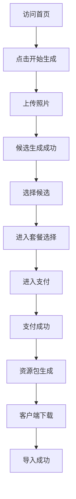

# 业务与市场分析修正版

## 1. 市场定位

本项目处于以下市场交叉点：

- 宠物经济。
- AI 图像生成。
- 桌面小组件/桌宠工具。
- 个性化数字礼物。
- 宠物纪念和情感消费。

核心商业判断：用户不是为“图片”付费，而是为“我家宠物被数字化、可陪伴、可保存”付费。

## 2. 目标客群

### 一级用户

- 猫狗主人。
- 宠物情感投入高的人。
- 长时间使用电脑办公的人。

### 二级用户

- 宠物博主。
- 情侣礼物用户。
- 宠物摄影用户。
- 宠物离世纪念用户。

### B 端潜在客户

- 宠物店。
- 宠物医院。
- 宠物摄影机构。
- 宠物品牌。

## 3. 用户价值主张

一句话：

> 把你家的宠物变成一只长期陪在电脑桌面的数字伙伴。

价值拆解：

- 情感：让宠物陪伴工作。
- 纪念：保存宠物形象。
- 展示：可分享给朋友。
- 实用：能在桌面运行，不是一次性图片。
- 资产：有宠物码和资源包，可找回。

## 4. 商业模式

### 4.1 主收入

| 收入项 | 价格建议 | 说明 |
| --- | --- | --- |
| 基础版桌宠 | ¥9.9-19.9 | 首次体验 |
| 高级版桌宠 | ¥29.9-49.9 | 主力客单 |
| 候选刷新 | ¥1-3 | 降低不满意损失 |
| 专属定制 | ¥99+ | 高客单服务 |

### 4.2 扩展收入

- 艺术相册。
- 节日主题包。
- 宠物动作包。
- 宠物饰品。
- 多宠物同屏。
- 宠物纪念服务。
- 宠物店联名。

## 5. 转化漏斗

关键漏斗指标：

- 首页 CTA 点击率。
- 上传完成率。
- 候选生成成功率。
- 候选选择率。
- 套餐点击率。
- 支付成功率。
- 资源包生成成功率。
- 客户端导入成功率。

## 6. 竞争策略

不建议复制竞品，而是做差异化：

| 方向 | 竞品常见做法 | 我们建议 |
| --- | --- | --- |
| 生成 | 多候选图 | 增加可调参数 |
| 隐私 | 云端处理 | 强化删除周期/本地优先 |
| 客户端 | 基础桌宠 | 更稳定、更易安装 |
| 付费 | 基础/高级 | 先低价验证，再扩高级 |
| 社区 | 云养广场 | 后置，不进 MVP |
| 复购 | 艺术相册 | 先做分享卡，再做相册 |

## 7. 增长实验

### 实验 1：免费候选次数

目的：验证免费次数对上传率和付费率的影响。

方案：

- A 组：1 次免费候选。
- B 组：2 次免费候选。
- C 组：免费候选但需登录。

指标：

- 上传率。
- 付费率。
- 生成成本。

### 实验 2：套餐价格

方案：

- 基础版 ¥9.9 vs ¥19.9。
- 高级版 ¥29.9 vs ¥39.9。

指标：

- 支付成功率。
- 客单价。
- 收入/生成成本比。

### 实验 3：案例展示形式

方案：

- 真实照片 + 桌宠对比图。
- 桌面运行视频。
- 用户评价。

指标：

- 首页 CTA 点击率。
- 页面停留时长。

## 8. 市场进入策略

第一阶段：小范围种子用户。

- 找 30-50 个宠物主人试用。
- 人工筛选高质量案例。
- 先收集“像不像”反馈。
- 用手动支付或 mock 支付验证付费。

第二阶段：内容传播。

- 发布桌宠运行短视频。
- 鼓励用户晒桌面。
- 做节日主题活动。
- 做宠物真实照片对比图。

第三阶段：商业化扩大。

- 接入正式支付。
- 加入账号资产。
- 推高级动作包。
- 接入艺术相册。

## 9. 业务风险

最大业务风险不是没有功能，而是：

1. 生成不像。
2. 付款后交付慢。
3. 客户端安装失败。
4. 用户不知道如何导入。
5. 图片隐私顾虑。

所以前期应该把预算集中在：

- 生成质量。
- 交付稳定性。
- 安装体验。
- 客服闭环。

## 10. 商业结论

这是一个值得验证的小而美产品方向。它的优势在于情感消费强、客单价可接受、可延展模块多。但它不适合一开始就做大而全，必须先验证“上传照片 -> 生成像 -> 付款 -> 桌面可用”这条链路。

