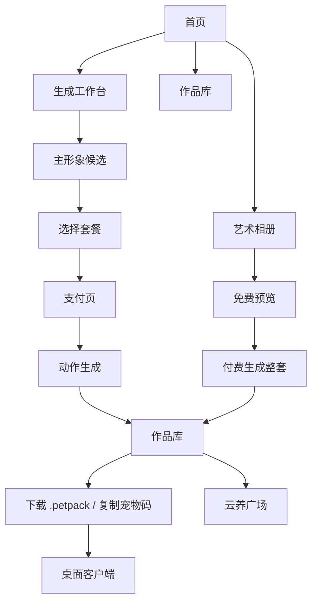
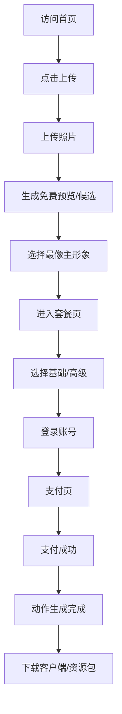

# PetDex 类养宠桌宠网站产品与市场分析报告

> 项目管理提示：本文是早期业务分析原始版，保留用于追溯。正式商业判断和项目汇报请优先使用 `docs/petdex-delivery/03-业务与市场分析修正版.md`，项目执行请以 `docs/petdex-delivery/00-交付总览.md` 为入口。

采集基础：基于 2026-06-11 对 `https://petdex.cc/#home` 的页面、交互、支付、作品库、艺术相册、云养广场、下载页和前端状态逻辑采集结果。  
报告视角：产品经理 + 市场分析。  
适用目标：为自研“AI 养宠/桌宠生成网站”提供产品规划、商业模式、功能优先级和市场落地参考。

> 重要说明：本报告用于分析同类产品的业务结构和用户体验，不建议复制对方品牌、素材、文案、真实案例图、客户端命名或商业标识。真正上线时应使用自有品牌、原创素材和差异化产品定位。

## 1. 执行摘要

PetDex 本质上不是一个单纯的 AI 图片生成站，而是一个“宠物照片资产化”的小型商业闭环产品。它把用户上传的宠物照片转化为三类可变现资产：

1. 可安装到电脑桌面的动态桌宠资产。
2. 可下载、可找回、可复用的 `.petpack` 或宠物码资产。
3. 可传播的艺术相册、云养广场和分享内容。

从产品设计看，它把 AI 生成的不确定性包装成分阶段体验：先免费预览，再选候选图，再付费生成完整动作包，最后进入桌面客户端陪伴。这个路径有效降低了用户对 AI 生成质量的担忧，也把“购买一张图”升级成“购买一只可以长期陪伴的宠物”。

从商业角度看，它的核心转化点有三层：

- 低价尝鲜：¥9.9 基础体验版。
- 推荐主力：¥29.9 高级陪伴版。
- 高客单服务：专属定制，按需报价。

同时，它通过艺术相册、候选刷新券、加赠基础版券、客户端长期使用和云养广场，构建了多次消费和社交传播的空间。

## 2. 产品定位分析

### 2.1 产品一句话定位

上传一张宠物照片，把真实宠物生成可安装到电脑桌面的 AI 桌宠，并提供作品管理、艺术相册和云养社区。

### 2.2 面向用户

核心用户：

- 猫狗宠物主人。
- 想把宠物留在电脑桌面的办公人群。
- 愿意为宠物周边、头像、壁纸、纪念品付费的情感消费用户。
- 喜欢像素风、桌宠、小组件、陪伴感工具的人。

潜在扩展用户：

- 宠物离世纪念用户。
- 情侣/朋友之间互送宠物数字礼物。
- 宠物博主、萌宠内容创作者。
- 宠物店、宠物摄影、宠物用品品牌的营销合作对象。

### 2.3 核心用户需求

用户显性需求：

- 想把自家宠物做成桌面上的可爱形象。
- 想生成宠物头像、壁纸、艺术照。
- 想保存、找回、下载自己的作品。
- 想在不同电脑上继续使用同一只桌宠。

用户隐性需求：

- 想要情感陪伴，而不是一次性图片。
- 想证明生成结果“像我家宠物”。
- 想让购买过程可控，不想盲付。
- 想得到一个可展示、可分享、可炫耀的结果。

## 3. 产品结构梳理

PetDex 的功能不是平铺页面，而是围绕“生成桌宠”这个主链路逐步展开。

### 3.1 主功能模块

| 模块 | 作用 | 商业价值 |
| --- | --- | --- |
| 首页 | 建立认知、展示案例、引导上传 | 提高首屏转化 |
| 生成工作台 | 上传宠物、生成候选、选择套餐、支付 | 核心收入入口 |
| 作品库 | 保存作品、找回宠物码、下载资源包 | 提升复购和留存 |
| 下载桌宠 | 提供客户端和安装说明 | 完成产品交付 |
| 定制方案 | 展示套餐权益 | 承接价格决策 |
| 艺术相册 | 生成宠物写真 | 第二收入曲线 |
| 云养广场 | 多用户桌宠展示互动 | 社交传播与社区留存 |
| FAQ | 降低购买、安装和版权顾虑 | 降低客服成本 |
| 账号中心 | 保存订单、次数、pet code、下载记录 | 建立用户资产账户 |
| 公告系统 | 活动、故障、版本通知 | 运营触达 |

### 3.2 页面关系

## 4. 核心用户旅程

### 4.1 新用户首次生成桌宠路径

1. 进入首页。
2. 看到真实案例和“上传宠物照片”按钮。
3. 进入生成工作台。
4. 填写宠物名字和性格描述。
5. 上传一张宠物照片。
6. 生成免费预览或主形象候选。
7. 从候选中选择最像的一张。
8. 进入套餐选择。
9. 选择基础版或高级版。
10. 登录账号，确保订单和宠物码可保存。
11. 进入支付页。
12. 支付成功后继续生成动作包。
13. 生成完成后获得宠物码和 `.petpack`。
14. 下载客户端。
15. 导入宠物码或资源包。
16. 桌宠出现在电脑桌面。

这个路径的关键设计在于“先看像不像，再付费”，适合 AI 生成产品，因为用户最担心的是结果不可控。

### 4.2 回访用户路径

1. 登录账号。
2. 进入作品库。
3. 查看历史宠物。
4. 下载资源包或复制宠物码。
5. 切换电脑后重新导入。
6. 可选择升级高级版、生成艺术照或加入云养广场。

### 4.3 艺术相册用户路径

1. 进入艺术相册。
2. 选择 A/B/C/D/E 套系。
3. 上传宠物正视图。
4. 免费预览。
5. 满意后付费生成整套 10 张高清壁纸。
6. 下载整套或单张查看。

艺术相册是典型的横向变现模块：不依赖桌面客户端，也能面向更广泛的宠物图片消费需求。

## 5. 功能体系分析

### 5.1 生成工作台

生成工作台是整个产品的核心。它把复杂的 AI 生产流程拆成多个用户可理解阶段：

- 空状态：等待上传第一只宠物。
- 上传状态：填写信息和选择照片。
- 生成中：展示步骤和预计耗时。
- 预览状态：让用户判断方向是否正确。
- 候选状态：从多张主形象里选择最像的。
- 套餐选择：将用户带入付费决策。
- 支付状态：完成订单。
- 完成状态：交付宠物码和资源包。

产品价值：

- 把 AI 黑盒过程可视化。
- 用免费预览降低首次尝试门槛。
- 用多候选降低生成不满意概率。
- 用“动作资源包”提高产品感和付费合理性。

### 5.2 支付页

支付页位于生成工作台内部，不是独立页面。这是一个很重要的产品决策：用户在付款时仍然能看到左侧上传信息和当前宠物上下文，避免“我到底在买什么”的断裂感。

支付页核心元素：

- 宠物名。
- 套餐名。
- 价格。
- 支付宝扫码支付。
- 微信暂不支持。
- 支付二维码区。
- 支付倒计时。
- 订单号、状态、支付方式。
- “我已支付，检查状态”。
- 取消订单。

业务逻辑：

- 选择套餐后创建订单。
- 创建支付 checkout。
- 返回二维码或外部支付链接。
- 前端保存 pending 状态，避免刷新后丢单。
- 用户关闭支付时尝试取消 pending 订单。
- 支付成功后自动进入动作生成。

产品亮点：

- 支付链路和生成链路强绑定。
- 有防重复下单设计。
- 有二维码过期处理。
- 有支付状态复查入口。

可改进点：

- 微信支付禁用会影响部分用户转化。
- 支付页位于工作台右侧，在小屏上可能需要更强的移动端适配。
- 如果二维码慢，用户需要明确看到“正在连接支付通道”的进度反馈。

### 5.3 作品库

作品库承担“用户资产中心”的角色。它不是简单 gallery，而是连接交付、下载、升级、分享、复用的枢纽。

关键功能：

- 公开作品展示。
- 我的作品展示。
- 登录引导。
- 下载 `.petpack`。
- 复制宠物码。
- 继续生成/修复。
- 升级高级版。
- 进入云养广场。

业务价值：

- 提高用户回访理由。
- 降低换设备后的找回成本。
- 承接升级和复购。
- 为公开案例提供素材来源。

### 5.4 下载桌宠

下载页把网页生成和桌面陪伴连接起来，是产品闭环的最后一环。

采集到的客户端下载项：

| 平台 | 下载链接形态 | 定位 |
| --- | --- | --- |
| Windows 64 位 | `PetDex-win-x64-v0.3.7.zip` | 推荐，免安装测试包 |
| macOS Apple Silicon | `PetDex-mac-arm64-v0.3.7.zip` | M 系列芯片 |
| macOS Intel | `PetDex-mac-x64-v0.3.7.zip` | Intel Mac |

产品设计重点：

- 解释客户端和资源包分开保存。
- 明确 `.petpack` 是宠物资源包。
- 提供 Windows/macOS 安装指南。
- 提醒 Windows SmartScreen 和 macOS 未签名提示。
- 支持宠物码或资源包导入。

### 5.5 艺术相册

艺术相册是第二商业线。它把同一批宠物用户转化为壁纸、写真、头像用户。

产品结构：

- 选择套系。
- 上传正视图。
- 免费预览。
- 付费生成整套。
- 每套 10 张图。
- 支持精选图册浏览。

套系分类：

- A 套：手绘萌宠。
- B 套：清新日常。
- C 套：风格大片。
- D 套：国风祥瑞。
- E 套：Q 版贴纸。

业务价值：

- 不依赖桌面客户端，付费门槛更轻。
- 适合社交分享传播。
- 可作为节日活动、宠物纪念、礼物场景扩展。

### 5.6 云养广场

云养广场是社区化尝试。它让桌宠从个人桌面资产变成公共展示资产。

采集到的规则：

- 开放 3 个广场。
- 每个广场最多 50 只宠物。
- 好友选择同一广场，桌宠出现在同一片场地。
- 支持选择宠物。
- 支持点赞、投喂、排名。
- 支持散开、暂停、上一只/下一只。

产品价值：

- 增加用户展示欲和分享动机。
- 让作品不只存在本地。
- 给宠物生成结果提供社交场景。
- 未来可接排行榜、活动赛、宠物名片。

风险：

- 社区需要内容审核。
- 宠物素材版权和他人照片上传要有规则。
- 多宠物动效可能带来性能压力。

## 6. 商业模式分析

### 6.1 收入来源

当前可拆出 5 类收入：

1. 基础桌宠生成：¥9.9。
2. 高级桌宠生成：¥29.9。
3. 候选刷新券：¥1。
4. 艺术相册整套生成。
5. 专属定制，按需报价。

未来可扩展收入：

- 节日主题动作包。
- 更多艺术相册套系。
- 多宠物同屏。
- 宠物皮肤/饰品。
- 企业/宠物店定制。
- 宠物纪念版高客单服务。
- 云养广场活动位或宠物名片装饰。

### 6.2 套餐策略

PetDex 的套餐设计遵循经典的“三档定价”：

| 档位 | 目的 | 用户心理 |
| --- | --- | --- |
| 低价体验 | 降低首次付费门槛 | 先试试看 |
| 推荐高级 | 承接主力收入 | 既然要做，不如做完整 |
| 专属定制 | 锚定高价值 | 我想要更像、更特别 |

高级版还加赠基础版券，形成两个效果：

- 提升高级版性价比。
- 激励用户再生成第二只宠物，增加复购或分享。

### 6.3 支付转化漏斗

漏斗关键影响因素：

- 首页案例是否足够真实。
- 上传步骤是否简单。
- 生成候选是否像。
- 套餐权益是否讲清楚。
- 支付方式是否便利。
- 生成等待是否有进度反馈。
- 安装客户端是否容易。

## 7. 市场机会分析

### 7.1 所在市场

该产品位于几个市场交叉点：

- AI 图片生成。
- 宠物经济。
- 桌面小组件/桌宠工具。
- 数字纪念品。
- 个性化礼物。
- 宠物摄影和周边。

宠物经济有强情感消费属性。用户不是为了功能效率付费，而是为了“我家宠物被看见、被保存、被陪伴”的情绪价值付费。

### 7.2 用户付费动机

强动机：

- 我的宠物很可爱，我愿意为它花小钱。
- 我想让宠物一直陪着我工作。
- 我想要一个像我家宠物的数字形象。
- 我想把它做成头像、壁纸、贴纸、分享卡。

弱动机：

- 好奇 AI 能生成什么。
- 看到朋友分享后想试。
- 低价活动刺激尝鲜。

### 7.3 市场切入优势

与普通 AI 图站相比，桌宠产品有几个优势：

- 结果不是一次性图片，而是长期使用资产。
- 宠物主题情感更强，更容易付费。
- 客户端提供差异化，不容易完全被通用 AI 图工具替代。
- 作品库和宠物码形成账号资产。
- 云养广场和分享图可带来自传播。

### 7.4 市场挑战

主要挑战：

- AI 生成“像不像”是最大转化风险。
- 桌面客户端安装会带来信任和安全门槛。
- Windows/macOS 未签名会降低转化。
- 支付链路复杂，容易出现支付后等待焦虑。
- 宠物照片涉及用户私人内容，需要隐私说明。
- 宠物离世纪念场景情绪敏感，需要谨慎文案。

## 8. 运营策略分析

### 8.1 首发运营

适合的冷启动方式：

- 免费生成 1-2 次主形象候选。
- 公测低价活动。
- 高级版买赠。
- 展示真实案例对比图。
- 鼓励用户晒出桌面截图。
- 收集“像不像”反馈，优化模型。

### 8.2 内容传播

适合传播的内容形态：

- 宠物真实照片 vs 桌宠形象。
- 桌宠在桌面走动的视频。
- 宠物艺术相册九宫格。
- 云养广场截图。
- “我家宠物变成桌宠了”故事。
- 宠物离世纪念类温情故事。

### 8.3 社群运营

可以建立：

- QQ/微信群答疑。
- 用户作品投稿。
- 每周最佳桌宠。
- 节日主题套系投票。
- 新动作共创投票。
- 宠物广场活动。

### 8.4 客服重点

FAQ 中已经暴露用户最关心的问题：

- 生成失败怎么办。
- 不满意能否重来。
- 付费后多久拿到。
- 支持哪些付款方式。
- macOS 安装提示怎么处理。
- 换电脑能不能继续用。
- 能不能传朋友/明星/动漫角色。

这说明产品客服重心在“生成质量 + 支付交付 + 安装安全 + 素材授权”四类问题。

## 9. 竞争与差异化建议

如果我们要做同类产品，不能只做“仿站”。需要建立自己的差异化。

### 9.1 可直接借鉴的结构

- 先免费预览，再付费生成。
- 多候选图选择。
- 作品库保存资产。
- 宠物码 + 资源包双交付。
- 客户端安装指南。
- 基础/高级/定制三档套餐。
- FAQ 降低安装和支付疑虑。

### 9.2 应该差异化的地方

建议做出自己的优势：

- 更强的本地隐私承诺：照片本地处理或明确删除周期。
- 更现代的桌面客户端体验。
- 更丰富的行为编辑器：用户可选性格、运动频率、停靠位置。
- 更强的“像不像”调参工具：耳朵、毛色、花纹、眼睛、体型可微调。
- 宠物纪念模式：温柔、克制、私密。
- 手机端传播页：生成宠物名片和短视频。
- 多宠物家庭模式：同时生成多只宠物。

### 9.3 我们的推荐定位

建议不要定位成“PetDex 复制品”，而是定位为：

“一款更私密、更可调、更适合长期陪伴的 AI 宠物桌面伙伴。”

核心差异：

- 强调隐私和本地保存。
- 强调个性可编辑。
- 强调长期陪伴，而不只是生成。
- 强调多平台桌面体验。

## 10. 产品优先级建议

### P0：必须先做

- 首页。
- 上传生成工作台。
- 免费候选生成。
- 候选选择。
- 基础套餐支付 mock。
- 作品库。
- 宠物码/资源包下载。
- Windows 桌面客户端基础导入。
- FAQ。

### P1：第二阶段

- 高级套餐。
- 多动作生成。
- 账号中心。
- 订单中心。
- macOS 客户端。
- 支付真实接入。
- 生成进度轮询。
- 安装指南图文版。

### P2：增长功能

- 艺术相册。
- 分享卡。
- 云养广场。
- 点赞/投喂/排名。
- 节日套系。
- 作品公开展示。

### P3：高级商业化

- 专属定制。
- 宠物纪念服务。
- 多宠物同屏。
- 行为编辑器。
- 宠物店/品牌合作。
- 会员或主题商店。

## 11. 关键指标设计

### 获客指标

- 首页访问量。
- 首页 CTA 点击率。
- 案例卡点击率。
- 新用户上传率。

### 生成指标

- 上传成功率。
- 候选生成成功率。
- 平均生成时长。
- 候选选择率。
- 重新生成率。
- 用户主观满意度。

### 商业指标

- 套餐页到支付页转化率。
- 支付页到支付成功率。
- 基础版购买率。
- 高级版购买率。
- 客单价。
- 复购率。
- 艺术相册购买率。

### 交付指标

- 动作包生成成功率。
- `.petpack` 下载率。
- 客户端下载率。
- 客户端首次导入成功率。
- 安装问题咨询率。

### 留存与传播

- 作品库回访率。
- 宠物码复制率。
- 分享卡生成率。
- 云养广场加入率。
- 点赞/投喂互动率。

## 12. 风险与应对

| 风险 | 影响 | 应对 |
| --- | --- | --- |
| 生成不像 | 直接影响付费 | 多候选、可重试、局部微调 |
| 等待时间长 | 用户流失 | 明确进度、后台完成提醒 |
| 支付后焦虑 | 客诉 | 订单状态、自动轮询、人工入口 |
| 客户端安装困难 | 交付失败 | 图文指南、签名、安装包优化 |
| 用户照片隐私 | 信任风险 | 隐私政策、删除机制、本地优先 |
| 内容侵权 | 法务风险 | 上传声明、审核、禁止明星/动漫角色 |
| 社区滥用 | 品牌风险 | 举报、审核、公开作品开关 |
| 多端兼容 | 成本上升 | 先 Windows，再 macOS |

## 13. 建议的产品路线图

### 第 1 阶段：验证付费意愿

目标：证明用户愿意为“像自己宠物的桌宠”付费。

范围：

- 首页。
- 上传生成。
- 6 张候选图。
- 基础版 mock 动作包。
- 作品库。
- Windows 客户端。
- 手动/半自动支付。

核心指标：

- 上传到候选选择率。
- 候选选择到支付率。
- 支付成功率。

### 第 2 阶段：完善交付体验

目标：让用户付款后顺利拿到可用桌宠。

范围：

- 自动动作包生成。
- 订单状态。
- 宠物码。
- `.petpack`。
- 客户端导入。
- 安装指南。
- 账号中心。

核心指标：

- 支付后交付成功率。
- 客户端导入成功率。
- 客诉率。

### 第 3 阶段：扩展复购与传播

目标：从一次性生成变成宠物数字资产平台。

范围：

- 艺术相册。
- 分享卡。
- 云养广场。
- 高级动作包。
- 主题套系。
- 多宠物。

核心指标：

- 复购率。
- 分享率。
- 云养广场互动率。

## 14. 最终结论

PetDex 的核心启发是：AI 宠物产品不应该只卖“生成图片”，而应该卖“被长期陪伴的宠物资产”。它通过生成工作台、作品库、桌面客户端、支付套餐、艺术相册和云养广场，把一次上传转化为一个完整消费闭环。

对我们来说，最值得借鉴的是它的业务结构：

- 免费预览解决信任。
- 多候选解决不确定性。
- 桌面客户端提高产品壁垒。
- 作品库沉淀用户资产。
- 低价套餐完成首次付费。
- 高级版提高客单价。
- 艺术相册和云养广场扩展复购与传播。

如果要做同类产品，建议优先验证“上传照片 -> 生成像的候选 -> 付费得到可用桌宠”这一条主链路。只要这条链路成立，后续的艺术相册、广场、定制、主题商店都可以作为增长模块逐步叠加。
