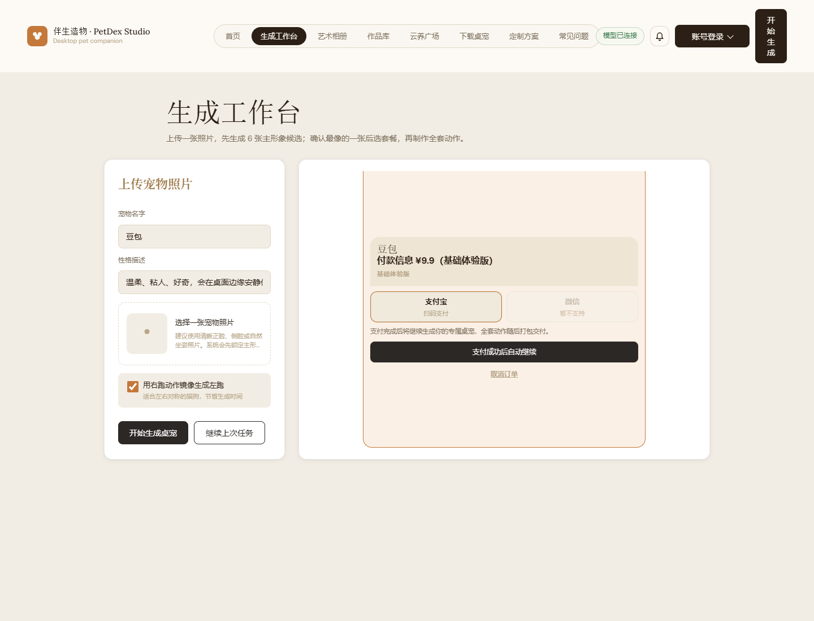
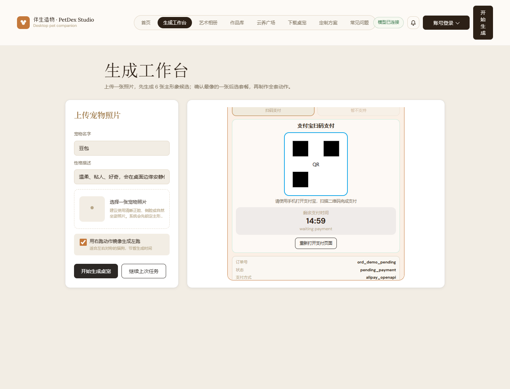
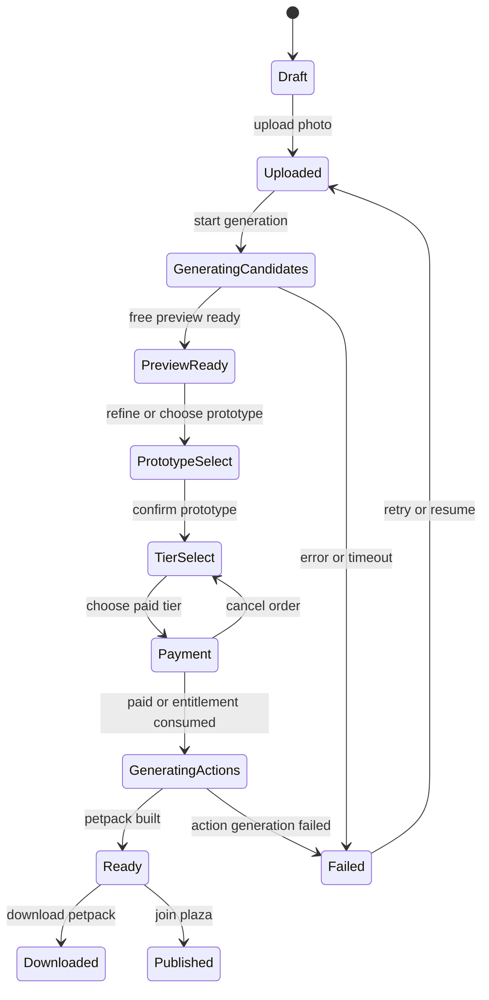
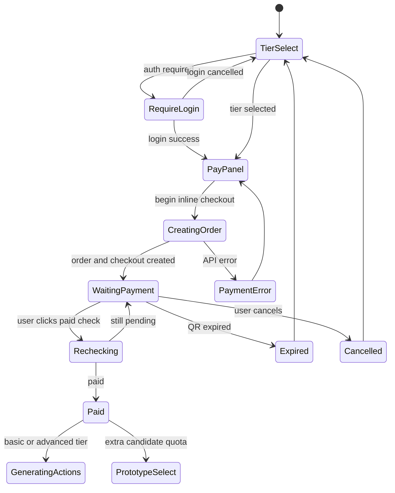
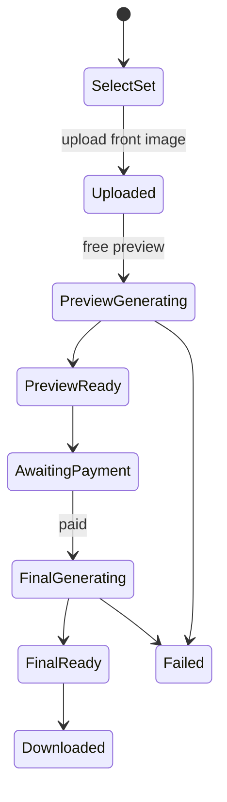

# 养宠桌宠网站需求文档：Petdex 竞品拆解版

> 项目管理提示：本文是早期竞品拆解原始版，保留用于追溯。正式立项、设计和研发请优先使用 `docs/petdex-delivery/02-修正版产品需求PRD.md`，并结合 `docs/petdex-delivery/05-证据目录与采集文件说明.md` 判断截图和采集文件可信度。

采集对象：https://petdex.cc/#home  
采集时间：2026-06-11  
产物目录：`docs/petdex-analysis/`

> 说明：本文用于拆解页面结构、交互路径、功能边界和实现需求。上线产品应使用自有品牌、原创素材、原创文案和独立视觉系统，避免直接复制 Petdex 的商标、示例宠物图、艺术图、公告文案、下载包命名和商业标识。

## 1. 产品定位

目标产品是一个“AI 宠物生成 + 桌面陪伴客户端 + 作品资产管理 + 社区展示”的商业化网站。用户上传宠物照片后，网站先生成主形象候选，再引导用户选择套餐、生成动作资源包，最终通过桌面客户端导入 `.petpack` 或宠物码，让宠物出现在电脑桌面。

核心卖点不是单张 AI 图片，而是“可安装、可陪伴、可管理、可分享”的桌宠资产。

## 2. UI 参考截图

### 首页


### 生成工作台


### 艺术相册


### 作品库


### 云养广场


### 下载桌宠


### 定制方案


### 常见问题


### 首访新手引导


### 公告弹窗


### 支付页：待创建/确认支付方式



### 支付页：二维码待支付态



注：二维码待支付态截图为基于站点前端 DOM 的状态复现，用于识别 UI 和逻辑，不包含真实订单或真实支付二维码。

### 移动端首页


## 3. 信息架构

顶层导航包含 8 个页面：

1. 首页：品牌介绍、主 CTA、案例展示、产品流程说明。
2. 生成工作台：上传宠物照片，填写宠物信息，生成主形象候选。
3. 艺术相册：上传宠物正视图，选择艺术套系，生成一套写真图。
4. 作品库：展示公开作品和用户自己的作品，支持找回、预览、下载、继续生成。
5. 云养广场：让多个桌宠进入同一广场，支持选择、点赞、投喂、排名和好友同场。
6. 下载桌宠：提供 Windows/macOS 客户端下载和安装指南。
7. 定制方案：展示套餐和付费权益。
8. 常见问题：解释生成、付费、安装、授权、系统支持、联系方式。

全局固定组件：

- 左侧品牌区：图标 + 产品名 + 英文副标题。
- 中央胶囊导航：当前页使用深色填充，未选中为浅色文字。
- 运行状态胶囊：展示模型/服务连接状态。
- 公告铃铛：打开公告弹窗。
- 账号登录按钮：打开登录/账号中心。
- 右侧悬浮纵向按钮：快速进入生成流程。
- 页面底部/桌面层宠物：装饰性桌宠会在页面底部或右侧活动。

### 3.1 页面切换校准

第二轮精采集确认：站点不是普通多页面跳转，而是单页应用内的 `pageView` 状态切换。导航按钮通过 `data-page-link` 切换页面，并同步修改 hash。

| 导航 | hash | 激活页面 id | 特殊逻辑 |
| --- | --- | --- | --- |
| 首页 | `#home` | `page-home` | body 增加 `page-home-active` |
| 生成工作台 | `#studio` | `page-studio` | 内部还有二级 phase 状态机 |
| 艺术相册 | `#art-album` | `page-art-album` | 套系按钮切换图册预览 |
| 作品库 | `#library` | `page-library` | 登录前只显示公开作品和登录引导 |
| 云养广场 | `#plaza` | `page-plaza` | body 切到 `isPlazaPage`，顶部导航隐藏，进入沉浸式场景 |
| 下载桌宠 | `#install` | `page-install` | Windows/macOS 指南切换 |
| 定制方案 | `#pricing` | `page-pricing` | 套餐按钮只引导到工作台，不直接付款 |
| 常见问题 | `#faq` | `page-faq` | FAQ 手风琴展开 |

重要校准：定制方案页的“开始体验/选择推荐方案”按钮只是 `data-page-link="studio"`，并不直接打开支付。真实支付页在生成工作台内部，必须先经过上传、候选图、确认主形象、选择套餐，才进入支付阶段。

## 4. 视觉设计规范

整体风格是温暖、手作、复古、轻商业化的桌宠工作室感。

### 色彩

- 页面背景：暖米白、浅奶油色。
- 主文字：接近黑褐色，避免纯黑。
- 品牌强调：焦糖橙、铜棕色。
- 边框：浅棕灰。
- 成功状态：浅绿色胶囊。
- 主按钮：深咖啡色底，白字。
- 次按钮：米白底，浅棕边框，深色文字。

建议变量：

```css
:root {
  --page-bg: #f4eee5;
  --surface: #fffaf3;
  --surface-2: #efe6da;
  --text: #2a211b;
  --muted: #7a6e5a;
  --line: #e0d5c4;
  --accent: #c4783a;
  --accent-dark: #2a1d16;
  --success: #e9f7ec;
  --success-text: #2f8b51;
}
```

### 字体与排版

- 中文标题使用宋体/衬线风格，营造温柔、手作质感。
- 正文字体使用系统无衬线，提升可读性。
- Hero 标题应为两行，第二行用强调色。
- 页面容器最大宽度约 1100-1180px。
- 导航高度约 80-88px，桌面端 sticky 顶部。
- 卡片圆角约 10-18px，边框柔和，阴影很轻。

### 组件风格

- 胶囊导航：横向排列，当前项深色背景。
- 表单输入框：浅米底，细边框，圆角 8-10px。
- 上传框：虚线边框，内含图标占位和说明。
- 标签 chip：浅底、细边框、小字号。
- 图片卡片：上方图片/预览，下方名称、描述、动作标签。
- 弹窗：居中卡片 + 背景模糊/遮罩。
- 右侧悬浮按钮：竖排文字，深色背景，固定右上。

## 5. 页面级需求

### 5.1 首页

目标：让用户立即理解“上传照片生成桌面宠物”，并通过真实案例降低不确定感。

页面结构：

- Hero 居中布局。
- 顶部显示品牌宠物图标。
- 小标签说明 AI 桌面陪伴。
- 主标题强调“宠物进入桌面”。
- 一句话描述上传照片后生成桌宠。
- 社会证明：展示已生成/陪伴的宠物数量。
- 主 CTA：上传宠物照片。
- 次 CTA：查看作品库。
- 细说明：免费预览，满意后再下载客户端。
- 案例区：3 列卡片展示真实宠物照片和像素桌宠结果。
- 流程区：4 步说明上传、生成、验收、陪伴。
- 页面底部/右侧出现动态桌宠装饰。

交互要求：

- 点击主 CTA 跳转到生成工作台。
- 点击作品库跳转到作品库。
- 点击案例区的“生成你家宠物”卡片跳转生成工作台。
- 页面底部宠物可作为装饰，不阻塞主内容。
- 右侧悬浮“开始生成”在所有主页面可见。

验收标准：

- 首屏无需滚动即可看到品牌、主标题、主 CTA。
- 1440px 桌面下案例区露出第一行卡片。
- 移动端 hero 内容居中，CTA 纵向排列或自然换行。

### 5.2 生成工作台

目标：完成宠物桌宠资产生成的第一阶段：上传照片并生成主形象候选。

页面结构：

- 页面标题 + 简短说明。
- 左侧表单卡片。
- 右侧大预览/状态面板。
- 底部显示账号剩余次数和套餐购买入口。

表单字段：

- 宠物名字：文本输入，默认可填入示例名。
- 性格描述：文本输入，描述宠物性格、行为、陪伴感。
- 宠物照片：`image/*` 文件上传，必填。
- 镜像选项：复选框，默认开启，用右跑动作镜像生成左跑。

按钮：

- 开始生成桌宠。
- 继续上次任务。
- 点这里购买套餐。

空状态：

- 右侧显示宠物图标。
- 提示上传照片后会生成 6 张主形象候选。
- 展示未来动作标签，如待机、走路、睡觉、伸懒腰。

生成流程：

1. 用户填写名字、描述、上传照片。
2. 点击开始生成。
3. 前端校验照片是否存在、文件类型是否为图片。
4. 调用上传/生成接口。
5. 进入“生成中”状态：按钮禁用，预览区显示进度。
6. 成功后显示 6 张主形象候选。
7. 用户选择最像的一张。
8. 进入套餐选择或继续动作生成。

#### 工作台内部状态机校准

第二轮采集确认工作台内部使用 `.studio-phase` 切换，至少包含以下阶段：

| phase | 触发条件 | UI 说明 |
| --- | --- | --- |
| `empty` | 初始或没有任务 | 等待第一只宠物，提示上传后生成 6 张主形象候选，显示账号剩余次数 |
| `generating` | 提交照片后 | 展示 1-2 分钟生成提示、步骤进度、安装清单/动作图集/验收记录/资源包等产物提示 |
| `preview` | 免费预览生成后 | 文案为“这个方向像不像？”，用户可确认套餐或重新生成 |
| `prototype` | 进入精调候选选择 | 文案为“选一张最像的”，显示近期生成记录 |
| `tier-select` | 确认主形象后 | 三类购买卡：候选刷新券、基础体验版、高级陪伴版 |
| `pay` | 选择付费套餐后 | 内联支付面板，包含支付宝/微信方式、订单卡、二维码区、支付确认按钮 |
| `done` | 资源包完成 | 显示宠物码、查看动作、下载资产包、下载客户端、生成分享卡、升级完整版 |

关键触发逻辑：

- `confirmPrototypeButton`：未选中候选时摇动候选区并提示先选择；选中后若已有权益则直接动作生成，否则进入 `tier-select`。
- `data-tier-choice`：套餐卡按钮，进入 `handleTierChoiceClick`。
- 基础/高级套餐必须绑定 `jobId`，否则会弹出“请先上传一张宠物照片再选择套餐”并回到空状态，防止付款后无法触发生成。
- 若站点配置要求登录，会先打开登录弹窗，确保订单和购买次数绑定邮箱账号。
- 若启用网页内支付，会进入 `openPayment(tier)`，切到 `pay` 阶段。

异常状态：

- 未登录：允许免费次数体验，或提示登录后保存记录。
- 免费次数用尽：弹出低价继续生成候选的付费弹窗。
- 上传失败：提示检查图片大小/格式。
- 生成超时：保留任务 ID，允许“继续上次任务”恢复。
- 图片不合格：提示使用清晰、五官可见、无遮挡照片。

建议新增实现：

- 上传图片本地预览。
- 图片裁剪/旋转。
- 生成任务轮询进度条。
- 失败重试按钮。
- 生成结果版本记录。

### 5.3 艺术相册

目标：在桌宠生成之外，增加宠物艺术写真商品，提高转化和内容传播。

页面结构：

- 页面标题：上传正视图生成艺术照。
- 左侧创作台。
- 右侧套系预览图宫格。
- 下方精选图册列表。

创作台字段：

- 套系选择：A/B/C/D/E 五套。
- 上传正视图：文件上传。
- 上传按钮。
- 清空按钮。
- 免费预览次数说明。

套系结构：

- A：手绘萌宠。
- B：清新日常。
- C：风格大片。
- D：国风祥瑞。
- E：Q 版贴纸。

每个套系包含 10 张模板图。模板卡片结构：

- 序号圆点。
- 图片预览。
- 模板名。
- 套系名。

交互要求：

- 选择套系后，右侧预览宫格切换到对应套系。
- 上传图片后可先生成免费预览。
- 免费预览成功后显示预览结果。
- 满意后创建订单，付款后生成整套高清图。
- 图片可点击打开灯箱。
- 灯箱支持上一张/下一张/下载当前。
- 整套完成后支持打包下载。

状态：

- 未上传：展示模板预览。
- 上传中：上传按钮 loading。
- 预览生成中：显示等待状态。
- 预览成功：展示生成结果。
- 预览次数用完：提示付费生成整套。
- 订单生成中：展示订单状态和支付入口。
- 已完成：显示下载整套。

### 5.4 作品库

目标：用户找回所有生成结果，公开作品也能作为信任证明和转化入口。

页面结构：

- 页面标题 + 说明。
- 公开作品区：展示 6 个精选公开作品。
- 我的作品区：登录后展示个人作品；未登录显示引导。

公开作品卡片：

- 宠物名称。
- 套餐类型。
- 预览图。
- 点击后打开作品详情。

我的作品卡片：

- 宠物名。
- 生成状态。
- 套餐类型。
- pet code。
- 创建时间。
- 主图/动作预览。
- 下载 `.petpack`。
- 复制宠物码。
- 继续修复/继续生成。
- 分享到云养广场。

未登录状态：

- 提示登录邮箱后查看作品库。
- 显示“生成新的宠物”入口。
- 显示登录并生成按钮。

详情弹窗：

- 大图预览。
- 动作下拉选择。
- 当前动作动画预览。
- 下载资产包。
- 复制宠物码。
- 查看安装说明。

### 5.5 云养广场

目标：让生成结果变成可社交、可展示、可互动的公共场景。

页面结构：

- 全屏/沉浸式广场舞台。
- 左上返回按钮和 Petdex 标识。
- 顶部广场切换：1、2、3。
- 右上控制按钮：上一只、散开/随机、暂停、下一只。
- 中央为桌宠活动区域。
- 右侧/下方信息卡：选中宠物、互动按钮、排名/统计。
- 底部状态条：当前广场、容量、同步状态。

核心规则：

- 当前开放 3 个广场。
- 每个广场最多 50 只宠物。
- 好友进入同一广场可看到同一批桌宠。
- 未选择宠物时显示引导说明。
- 选择宠物后显示详情与互动。

交互：

- 点击广场编号切换场景。
- 点击“加入广场”把自己的桌宠加入当前广场。
- 点击桌宠选中。
- 点赞：增加点赞数。
- 投喂：增加投喂数。
- 排名：展示该广场排名。
- 暂停：停止宠物运动。
- 散开：重新分布宠物位置。
- 上一只/下一只：切换选中宠物。
- 返回：回到进入广场前的页面。

技术需求：

- 宠物动画帧资源加载。
- 舞台碰撞/边界控制。
- 多宠物随机运动。
- 定时同步广场列表。
- 同一广场容量限制。
- 防刷点赞/投喂。

### 5.6 下载桌宠

目标：提供客户端下载、安装说明和资源包导入路径，解决生成后“怎么用”的问题。

页面结构：

- 页面标题 + 核心说明。
- 下载卡片区。
- 三步开始陪伴。
- 详细安装指南。
- Windows/macOS 指南切换。

下载项：

- Windows 64 位，推荐下载，约 140MB。
- macOS Apple Silicon，约 114MB。
- macOS Intel，约 121MB。

按钮：

- 去作品库拿资源包。
- 每个平台下载按钮。
- 指南系统切换按钮。

安装指南要覆盖：

- 下载压缩包。
- 解压。
- 启动客户端。
- Windows SmartScreen 放行。
- macOS 安全提示处理。
- 导入宠物码或 `.petpack`。
- 系统托盘操作。

客户端能力：

- 导入多个宠物。
- 从云端通过宠物码拉取资源。
- 拖入 `.petpack`。
- 切换宠物。
- 退出应用。
- 后续可加入开机启动、透明窗口、边缘停靠、行为模式切换。

### 5.7 定制方案

目标：解释付费权益，引导用户从免费预览转向购买。

套餐结构：

| 套餐 | 价格 | 定位 | 核心权益 |
| --- | --- | --- | --- |
| 基础体验版 | ¥9.9 | 首次体验 | 基础动作、一次主形象生成、永久宠物码、双端可用 |
| 高级陪伴版 | ¥29.9 | 推荐方案 | 更多动作、行为模式、边缘趴伏巡游、加赠基础券 |
| 专属定制 | 按需报价 | 高客单服务 | 一对一沟通、外形/风格/动作定制、后续更新 |

交互：

- 点击基础体验：创建基础版订单或进入生成流程。
- 点击推荐方案：创建高级版订单。
- 点击咨询定制：打开联系方式/客服二维码/表单。
- 用户未登录时，购买前引导登录。
- 已登录时，订单绑定账号。

支付流程：

1. 选择套餐。
2. 创建订单。
3. 展示支付方式。
4. 跳转或弹出支付页。
5. 支付回调/用户确认。
6. 订单状态变为已支付。
7. 增加生成次数或解锁动作生成。

#### 支付页精确拆解

真实支付页不是独立 URL，而是生成工作台右侧预览区的 `studioStatePay` 内联面板。它会保留左侧上传表单，右侧从预览区切换成支付卡。

支付页 UI：

- 顶部显示宠物名，例如“豆包”。
- 标题：`付款信息 ¥9.9（基础体验版）` 或对应套餐与真实支付金额。
- 套餐副标题：套餐名、包含权益，例如基础体验版/高级陪伴版。
- 支付方式选择器：
  - 支付宝：可选，文案“扫码支付”。
  - 微信：显示“暂不支持”，按钮 disabled。
- 未创建订单时：
  - 隐藏二维码区。
  - 显示说明“支付完成后将继续生成你的专属桌宠，全套动作随后打包交付。”
  - 主按钮文案为“支付成功后自动继续”或“确认支付方式，生成二维码/创建支付订单”。
  - 次按钮：取消订单。
- 创建订单后：
  - 显示二维码卡。
  - 标题：支付宝扫码支付。
  - 提示：请使用手机打开支付宝，扫描二维码完成支付。
  - 显示倒计时，例如 `14:59`。
  - 状态文案：等待支付确认。
  - 按钮：重新打开支付页面。
  - 订单卡：订单号、状态、支付方式。
  - 主按钮切为“我已支付，检查状态”。

支付状态按钮文案会按阶段变化：

- `正在创建支付订单...`
- `正在连接支付通道...`
- `重试创建支付订单`
- `我已支付，检查状态`
- `我已支付，立即检查`
- `支付成功，正在继续生成...`
- `支付成功后自动继续`

支付接口逻辑：

1. 用户在 `tier-select` 点套餐按钮。
2. 前端进入 `handleTierChoiceClick(button, tier)`。
3. 检查是否有绑定的生成任务 `jobId`。
4. 必要时要求登录。
5. 调用 `openPayment(tier)`。
6. `openPayment` 设置 `checkoutState.phase = "pay"`，渲染支付页，调用 `beginInlineCheckout`。
7. `beginInlineCheckout` 先创建后端订单：`POST /api/orders`。
8. 随后创建支付通道 checkout：`POST /api/orders/:orderId/checkout`。
9. 如果返回二维码支付数据，渲染 `epayQrPanel` 并启动轮询。
10. 如果返回外部支付 URL，保存 `paymentRedirectUrl` 后跳转外部支付页。
11. 用户点击“我已支付，检查状态”后，前端会轮询/复查订单：
    - `GET /api/orders/:orderId`
    - `POST /api/orders/:orderId/alipay/recheck`
    - `POST /api/orders/:orderId/zpay/recheck`
12. 支付成功后，继续动作生成或补充生成次数。
13. 用户取消时，若订单为 `created/pending_payment`，调用 `POST /api/orders/:orderId/cancel`。

支付实现注意：

- 前端有防重复点击锁，防止用户连点套餐按钮瞬间创建多笔订单。
- 关闭支付面板会尽力取消 pending 订单，减少后台脏订单。
- 支付二维码有过期检查，过期后应回到套餐选择重新创建订单。
- 聚合支付可能存在“实付金额”和基础价格不同的情况，需要在标题和二维码提示里同步展示真实金额。

艺术相册支付是另一套流程：

- 艺术相册先上传图片并生成免费预览。
- 用户满意后点击整套生成/购买。
- 前端调用 `createArtAlbumOrder()`，请求 `POST /api/orders`，sku 为 `pet_art_album`。
- 支付完成后调用 `/api/art-albums/orders/:orderId/generate` 生成整套图。
- 完成后提供 `/api/art-albums/orders/:orderId/download` 下载整套。

### 5.8 常见问题

目标：降低用户对生成质量、付费、安装、授权和系统兼容的顾虑。

问题分类：

- 生成质量：是否每次成功、不满意能否重来。
- 套餐差异：基础版与高级版区别。
- 交付时间：付款后多久得到桌宠。
- 支付方式：支持哪些支付方式。
- 失败处理：生成失败或卡住怎么办。
- 系统支持：Windows/macOS、最低要求。
- macOS 安全提示：损坏、无法验证开发者。
- 换设备：宠物码是否可继续使用。
- 素材授权：朋友宠物、明星宠物、动漫角色是否可用。
- 更新：是否新增动作和表情。
- 联系方式：客服响应方式。

交互建议：

- 使用手风琴展开答案。
- 支持锚点跳转到“下载桌宠”安装指南。
- 联系方式提供复制按钮。

## 6. 全局交互与弹窗

### 6.1 首访新手引导

首次进入出现 3 步引导弹窗，背景模糊。

结构：

- 右上跳过。
- 步骤文案。
- 标题。
- 说明。
- 步骤圆点。
- 上一步/下一步按钮。

步骤建议：

1. 上传宠物照片：强调清晰、正面、五官可见。
2. 选择主形象候选：从 6 张候选里选最像的一张。
3. 下载客户端陪伴：生成资源包并导入桌面客户端。

行为：

- 首访自动出现。
- 跳过后写入本地标记。
- 下一步到最后一步后按钮变为“开始生成”。
- 不应每次刷新都强制出现。

### 6.2 公告弹窗

公告由铃铛触发，也可能首访自动弹出。

结构：

- 遮罩 + 居中卡片。
- 顶部标题。
- 关闭按钮。
- 多条公告列表。
- 当前公告展开显示正文、发布日期。
- 底部确认按钮。

功能：

- 支持多公告。
- 支持置顶标记。
- 支持已读状态。
- 支持按目标渠道展示，例如 web/client。
- 关闭后本地记忆，避免重复打扰。

### 6.3 登录/账号中心

登录弹窗字段：

- 邮箱账号。
- 密码。
- 显示/隐藏密码。
- 创建账号。
- 忘记密码。
- 登录按钮。
- 收起按钮。

账号中心字段：

- 当前账号。
- 剩余生成次数。
- 免费次数/购买次数。
- 修改密码。
- 我的订单。
- 我的 pet code。
- 未用权益。
- 历史下载。
- 刷新。
- 退出登录。

登录规则：

- 未登录也可浏览和体验部分功能。
- 登录后保存免费次数、购买次数、订单、pet code 和下载记录。
- 免费次数不是每日重置，属于账号总额度。

### 6.4 支付与次数弹窗

当免费次数用尽时，出现继续生成提示。

要求：

- 明确说明免费次数已用完。
- 提供小额继续生成入口。
- 提供取消按钮。
- 购买后补充生成次数。

## 7. 数据模型

### User

```ts
type User = {
  id: string;
  email: string;
  freeQuota: number;
  paidQuota: number;
  createdAt: string;
};
```

### PetJob

```ts
type PetJob = {
  id: string;
  userId?: string;
  petName: string;
  description: string;
  sourceImageUrl: string;
  mirrorLeft: boolean;
  status: "draft" | "uploading" | "generating_candidates" | "candidate_ready" | "awaiting_payment" | "generating_actions" | "ready" | "failed";
  candidateImages: CandidateImage[];
  selectedCandidateId?: string;
  tier?: "basic" | "pro" | "custom";
  petCode?: string;
  petpackUrl?: string;
  publicPetpackUrl?: string;
  actions: PetAction[];
  createdAt: string;
  updatedAt: string;
};
```

### PetAction

```ts
type PetAction = {
  key: string;
  name: string;
  frameUrl: string;
  previewGifUrl?: string;
  frameCount: number;
  durationMs: number;
};
```

### ArtAlbumOrder

```ts
type ArtAlbumOrder = {
  id: string;
  userId?: string;
  setId: "A" | "B" | "C" | "D" | "E";
  sourceImageUrl: string;
  status: "preview_ready" | "awaiting_payment" | "generating" | "ready" | "failed";
  previewImages: string[];
  finalImages: string[];
  downloadUrl?: string;
  createdAt: string;
};
```

### Order

```ts
type Order = {
  id: string;
  userId: string;
  productType: "pet_basic" | "pet_pro" | "art_album" | "extra_candidates" | "custom";
  amount: number;
  currency: "CNY";
  status: "created" | "pending_payment" | "paid" | "fulfilled" | "cancelled" | "failed";
  provider?: "wechat" | "alipay" | "mock" | "manual";
  providerPaymentId?: string;
  relatedJobId?: string;
  createdAt: string;
};
```

### PlazaPet

```ts
type PlazaPet = {
  id: string;
  plazaId: number;
  petCode: string;
  displayName: string;
  ownerName?: string;
  spriteUrl: string;
  likes: number;
  feeds: number;
  rank?: number;
  joinedAt: string;
};
```

## 8. API 需求

采集到的前端资源中出现了以下接口路径，可作为同类产品 API 设计参考：

```txt
GET  /api/runtime
GET  /api/features
GET  /api/announcements/active?target=web
POST /api/analytics/events

GET  /api/auth/get-session
POST /api/auth/sign-in/email
POST /api/auth/sign-up/email
POST /api/auth/sign-out
POST /api/auth/change-password

GET  /api/check-quota
POST /api/consume-quota
POST /api/credit-quota

GET  /api/pets
GET  /api/public-pets?page=1&limit=6
GET  /api/demo-petpack

GET  /api/orders
POST /api/orders
POST /api/orders/:orderId/checkout
GET  /api/orders/:orderId
POST /api/orders/:orderId/cancel
POST /api/orders/:orderId/alipay/recheck
POST /api/orders/:orderId/zpay/recheck
POST /api/payments/mock/confirm

GET  /api/art-albums/catalog
GET  /api/art-albums/assets/latest
POST /api/art-albums/uploads
POST /api/art-albums/orders/:orderId/generate
GET  /api/art-albums/orders/:orderId/download

GET  /api/community/plazas
GET  /api/community/plazas/:plazaId
GET  /api/community/plazas/:plazaId/pets/:petId/thumbnail.webp
GET  /api/releases
```

建议补充接口：

```txt
POST /api/pet-jobs
POST /api/pet-jobs/:id/source-image
POST /api/pet-jobs/:id/generate-candidates
POST /api/pet-jobs/:id/select-candidate
POST /api/pet-jobs/:id/generate-actions
GET  /api/pet-jobs/:id
GET  /api/pet-jobs/:id/download-petpack
POST /api/pet-jobs/:id/publish

POST /api/community/plazas/:id/join
POST /api/community/plazas/:id/pets/:petId/like
POST /api/community/plazas/:id/pets/:petId/feed
GET  /api/community/plazas/:id/ranking
```

## 9. 状态机

### 桌宠生成状态机



### 支付状态机



### 艺术相册状态机



## 10. 技术实现建议

前端：

- React + Vite。
- 页面状态用单页应用路由或 hash router。
- 组件拆分：Topbar、Hero、CaseGallery、GenerateStudio、ArtAlbumStudio、Library、Plaza、DownloadGuide、Pricing、FAQ、AuthOverlay、AnnouncementOverlay。
- 图片上传使用本地预览 + FormData。
- 生成任务使用轮询或 SSE。
- 动态桌宠用 CSS sprite animation 或 canvas。
- 云养广场建议 canvas/DOM sprite 均可，早期用 DOM sprite 更快。

后端：

- Node/Express 或 FastAPI。
- 图片上传存储：本地存储或对象存储。
- 任务队列：BullMQ/Redis 或轻量数据库状态轮询。
- AI 生成服务：独立 worker。
- 支付：先 mock，后接微信/支付宝。
- 账号：邮箱密码 + session cookie。
- 数据库：SQLite 起步，后期 PostgreSQL。

桌面客户端：

- Electron/Tauri 均可。
- 支持透明窗口、置顶、托盘、拖拽导入 `.petpack`。
- 支持宠物码拉取资源。
- 支持多宠物切换。
- 支持行为模式：陪伴、玩耍、休息。

## 11. 开发里程碑

### MVP 1：网站骨架

- 完成 8 个页面的静态 UI。
- 完成顶部导航、移动端适配、公告弹窗、新手引导。
- 使用 mock 数据展示案例、作品库、套餐、FAQ。

### MVP 2：生成工作台闭环

- 上传照片。
- 创建生成任务。
- 返回 6 张候选图。
- 选择候选图。
- 生成 mock 动作资源包。
- 作品库可查看任务。

### MVP 3：账号与订单

- 邮箱注册/登录。
- 免费次数管理。
- 套餐订单 mock。
- 支付成功后增加权益。
- 账号中心展示订单、pet code、下载记录。

### MVP 4：桌面客户端

- Electron/Tauri 客户端。
- 导入 `.petpack`。
- 桌面透明宠物窗口。
- 托盘菜单。
- 多宠物切换。

### MVP 5：艺术相册和云养广场

- 艺术套系模板。
- 上传生成预览。
- 支付后生成整套。
- 云养广场展示、点赞、投喂、排名。

## 12. 验收清单

- 首页首屏能在 1440px 与 390px 宽度正常展示。
- 顶部导航所有页面可达，当前页状态明确。
- 首访引导只出现一次，可跳过，可继续。
- 公告弹窗可打开、切换公告、关闭并记忆。
- 未登录用户可浏览所有公开页面。
- 登录弹窗支持登录、注册、忘记密码入口。
- 生成工作台未上传时不能开始生成，错误提示清晰。
- 上传图片后有本地预览。
- 生成中有进度和不可重复提交保护。
- 生成失败可重试，生成成功可选择候选。
- 免费次数、购买次数显示准确。
- 作品库公开作品与我的作品分区清晰。
- 下载页三个客户端版本有独立下载入口。
- 安装指南覆盖 Windows 和 macOS。
- 套餐页价格、权益、推荐状态明确。
- FAQ 可展开查看答案。
- 云养广场切换、暂停、选择、互动不会卡顿。

## 13. 本次采集文件

关键文件：

- `docs/petdex-analysis/dom-inventory.json`
- `docs/petdex-analysis/clean-page-inventory.json`
- `docs/petdex-analysis/nav-capture-inventory.json`
- `docs/petdex-analysis/clean-real-inventory.json`
- `docs/petdex-analysis/50-main-00-首页.png`
- `docs/petdex-analysis/50-main-01-生成工作台.png`
- `docs/petdex-analysis/50-main-02-艺术相册.png`
- `docs/petdex-analysis/50-main-03-作品库.png`
- `docs/petdex-analysis/50-main-04-云养广场.png`
- `docs/petdex-analysis/50-main-05-下载桌宠.png`
- `docs/petdex-analysis/50-main-06-定制方案.png`
- `docs/petdex-analysis/50-main-07-常见问题.png`
- `docs/petdex-analysis/31-state-auth.png`
- `docs/petdex-analysis/31-state-bell.png`
- `docs/petdex-analysis/50-mobile-main-home.png`
- `docs/petdex-analysis-round2/round2-inventory.json`
- `docs/petdex-analysis-round2/payment-correct-02-pay-default.png`
- `docs/petdex-analysis-round2/payment-correct-03-pay-qr-state.png`
- `docs/petdex-analysis-round2/payment-correct-state.json`
